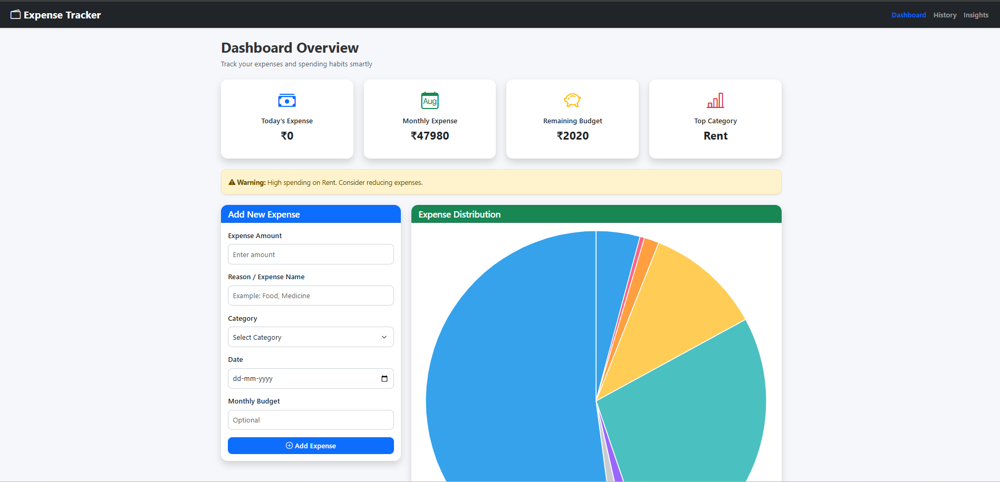
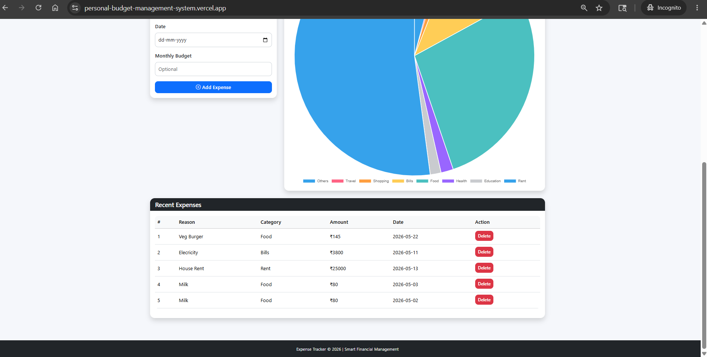
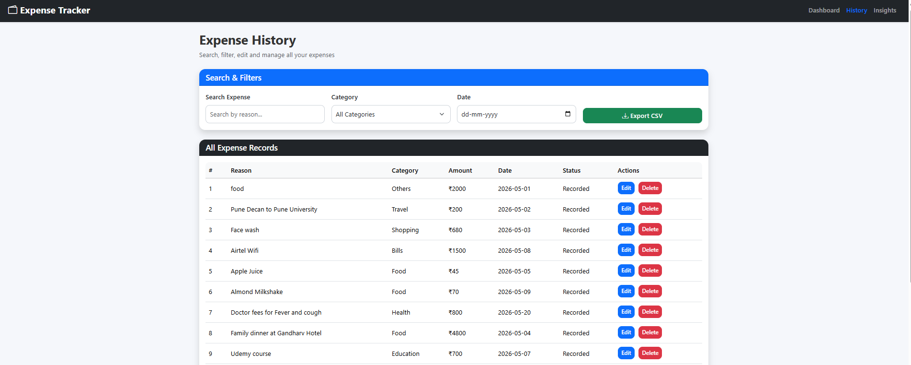
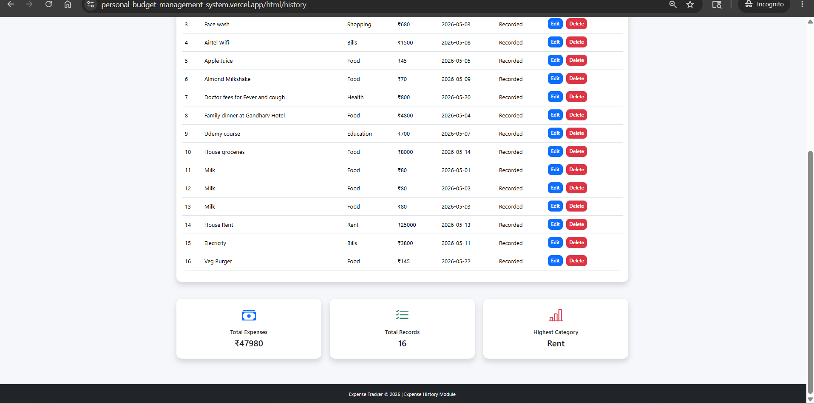
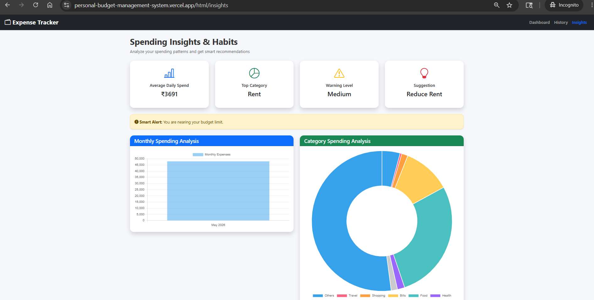
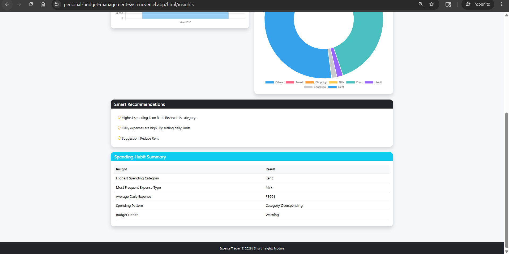

# Personal Budget Management System

A smart and user-friendly **Personal Budget Management System** designed to help users record spending, monitor budgets, analyze financial habits, and make better money decisions using interactive dashboards and smart insights.

## Problem This Project Solves

Managing personal finances manually can be difficult. Many people struggle to:

- Keep track of daily spending
- Understand where their money is going
- Identify overspending categories
- Monitor monthly budgets
- View spending history in one place
- Analyze financial habits with visual reports

This web application solves these problems by providing a **digital finance management dashboard** that helps users organize their spending records, monitor budget health, and get smart financial insights in a simple and visual way.

## Live Web Application

🚀 **Live Demo:** <a href="https://personal-budget-management-system.vercel.app/" target="_blank">Personal Budget Management System</a>

This is a **fully deployed live web application** and anyone can use it **free online**.

---

## Key Features

- Add and manage personal spending records
- Dashboard overview with smart analytics
- Monthly expense analysis charts
- Category-wise spending visualization
- Budget health monitoring
- Smart recommendations and alerts
- Expense history management
- Search and filter expense records
- Export data as CSV
- Delete and edit records
- Interactive charts and graphs
- Responsive modern UI design

---

## Technologies Used

- HTML
- CSS
- JavaScript
- Chart.js
- Local Storage
- Vercel Deployment

---

## Project Screenshots

### Dashboard Overview

### Dashboard Analytics View

### Expense History Page

### Expense History Details

### Spending Insights Dashboard

### Spending Summary & Recommendations

---

## How It Works

1. User adds spending details
2. Data gets stored in the browser
3. Dashboard calculates totals and budget health
4. Charts visualize spending patterns
5. Insights page analyzes habits
6. History page manages records
7. CSV export allows downloading data

---

## Why This Project Is Useful

This project helps users:

- Build better financial habits
- Reduce unnecessary spending
- Monitor budget status
- Analyze spending patterns
- Make smarter financial decisions
- Keep personal records organized digitally

---

## Future Improvements

- User authentication
- Cloud database integration
- Multi-user support
- PDF report generation
- AI-based financial suggestions
- Dark mode
- Mobile app version

---

## Developer

**Pradnya Naresh Ghodke**  
🔗 <a href="https://www.linkedin.com/in/pradnya-ghodke/" target="_blank">Pradnya Naresh Ghodke</a>

---

## License

This project is created for educational and portfolio purposes.
